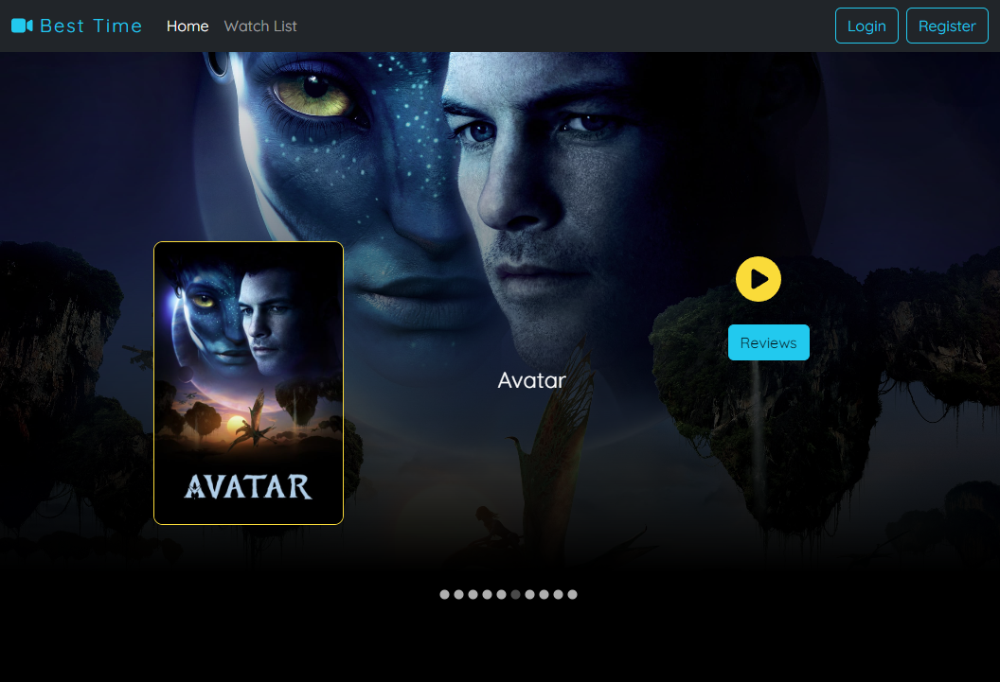
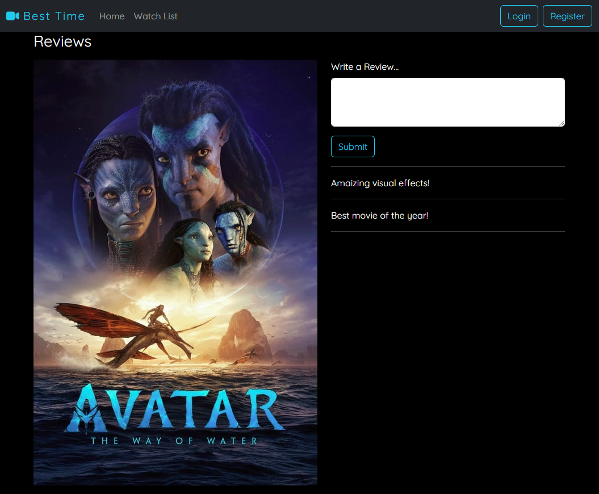
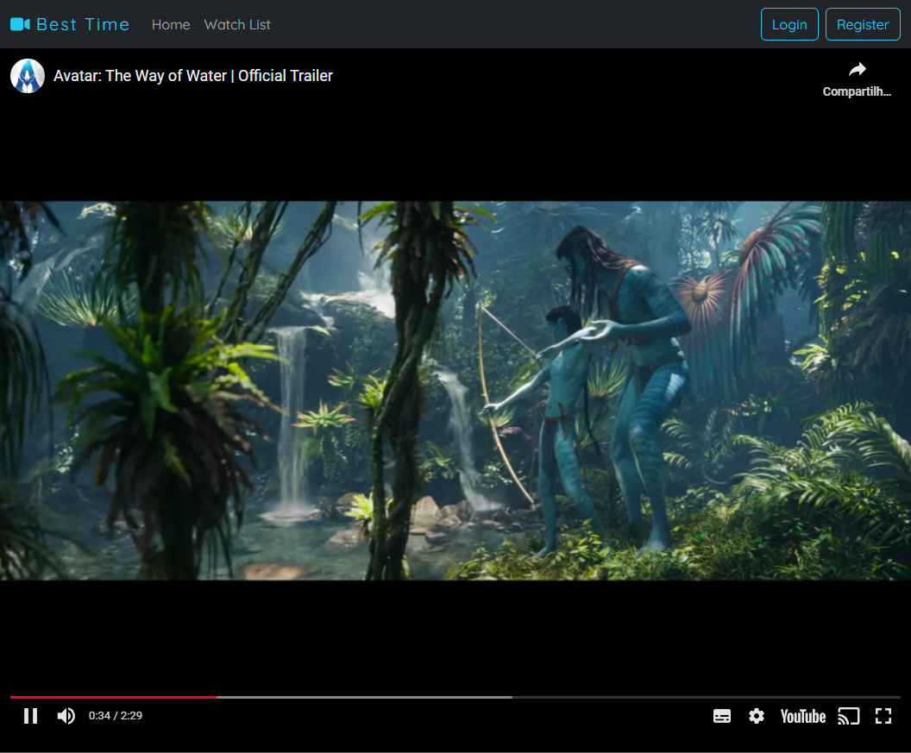

<h1 align="center">Movies Review</h1>

<p align="center">
  <a href="#-tecnologias">Tecnologias</a>&nbsp;&nbsp;&nbsp;|&nbsp;&nbsp;&nbsp;
  <a href="#-projeto">Projeto</a>&nbsp;&nbsp;&nbsp;|&nbsp;&nbsp;&nbsp;
  <a href="#-layout">Layout</a>&nbsp;&nbsp;&nbsp;|&nbsp;&nbsp;&nbsp;
  <a href="#-licença">Licença</a>
</p>

<br>

## 🚀 Tecnologias


## 💻 Projeto

**Uma aplicação web para cadastro de reviews de filmes.** Oferece funcionalidade de registrar o review de um filme. É possível reproduzir o trailer do YouTube diretamente na página.

## 🔖 Layout

### 1. Página Inicial
<p align="center">
  
</p>

### 2. Formulário de Review
<p align="center">
  
</p>

### 3. Trailer do YouTube
<p align="center">
  
</p>


## 🏃 Iniciando o Projeto
Primeiro clone este repositório remoto em sua máquina local:

[https://git@github.com:denisonkolling/movies-review-react.git](https://git@github.com:denisonkolling/movies-review-react.git)

Lembre-se de adicionar as dependências do projeto:

```bash
npm install
# ou
yarn install
```

Inicie o servidor de desenvolvimento:
```bash
npm run dev
# ou
yarn run dev
```

Acesse [http://localhost:5173/](http://localhost:5173/) com seu navegador para acessar a aplicação.

## 📝 Licença

Esse projeto está sob a licença MIT.

---